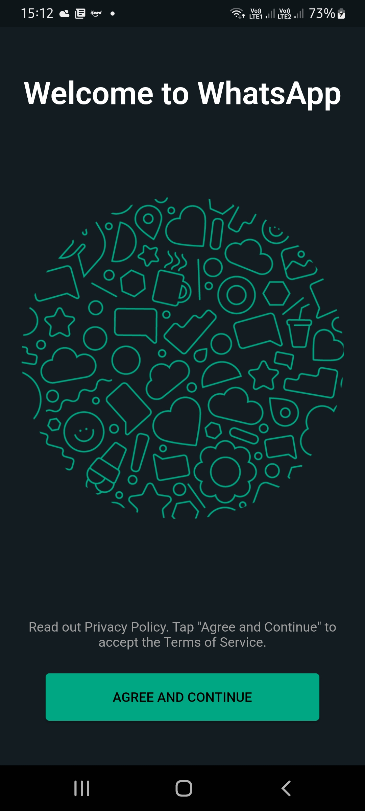
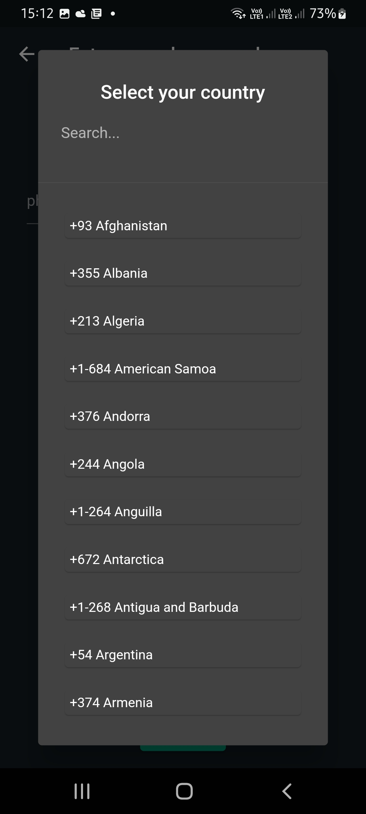

# Tiktok Clone

Hello there.
This is a WhatsApp clone developed in flutter.
This app was developed according to the classes of:

Flutter & Firebase Tutorial: Build 5 Social Media Apps - UDEMY;

### Versions

- **Flutter**: 3.0.4
- **Dart**: 2.17.5

### Setup

Clone it in your machine:
```bash
git clone https://github.com/RodrigoNP3/WhatsApp_Clone.git
```

Dependecies:

```bash
dependencies:
  cupertino_icons: ^1.0.2
  firebase_core: ^1.24.0
  firebase_auth: ^3.11.2
  firebase_storage: ^10.3.11
  cloud_firestore: ^3.5.1
  country_pickers: ^2.0.0
  change_app_package_name: ^1.1.0
  flutter_riverpod: ^2.0.0-dev.9
  image_picker: ^0.8.6
  flutter_contacts: ^1.1.5
  uuid: ^3.0.6
  intl: ^0.17.0
  cached_network_image: ^3.2.1
  video_player: ^2.4.5
  cached_video_player: ^2.0.3
  emoji_picker_flutter: ^1.3.0
  enough_giphy_flutter: ^0.3.0
  flutter_sound: ^9.2.13
  permission_handler: ^9.2.0
  path_provider: ^2.0.11
  audioplayers: ^1.0.1
  swipe_to: 1.0.2
  story_view: ^0.13.2
  agora_uikit: ^1.0.2
```

1 - Create e new projects ata firebase console.

Create a new Flutter app;

If you are having problems with that please, watch the following tutorial at 00:07:53.
https://www.youtube.com/watch?v=yqwfP2vXWJQ&ab_channel=RivaanRanawat

Add Phone authentication;

Create a Firestore Database;

Change the rules from:

```bash
rules_version = '2';
service cloud.firestore {
  match /databases/{database}/documents {
    match /{document=**} {
      allow read, write: if
          request.time < timestamp.date(2022, 10, 31);
    }
  }
}
```

Change to:

```bash
rules_version = '2';
service cloud.firestore {
  match /databases/{database}/documents {
    match /{document=**} {
      allow read, write: if request.auth != null;
    }
  }
}
```

Create a Storage Database;

Change the rules from:

```bash
rules_version = '2';
service firebase.storage {
  match /b/{bucket}/o {
    match /{allPaths=**} {
      allow read, write: if false;
    }
  }
}
```

Change to:

```bash
rules_version = '2';
service firebase.storage {
  match /b/{bucket}/o {
    match /{allPaths=**} {
      allow read, write: if request.auth != null;
    }
  }
}
```

Go to the project settings;

On android app put your SHA1 certificate fingerprints,

SHA1 certificate:

To get your SHA1 key you have to run this command in your terminal:
keytool -list -v -keystore ~.android\debug.keystore -alias androiddebugkey -storepass android -keypass android

if it dosn't work you can try put the full path: C:\Users\YOUR-USER.android...

Download the google-services.json and put it in the android/app folder.
android>app>google-services.json

On IOS app
Download the GoogleService-Info.plist and put it in the ios/Runner folder.
ios>Runner>GoogleService-Info.plist

open it and copy the reversed client id

 put your reversed client id into your info.plist file
  ```bash
	<array>
		<dict>
			<key>CFBundleTypeRole</key>
			<string>Editor</string>
			<string>CFBundleURLSchemes</string>
			<array>
				<string>YOUR REVERSED CLIENT ID HERE</string>
			</array>

		</dict>
	</array>
```

2 create the pod file

got to ios folder and run
pod install

In your pod fole uncomment the line 2
```bash
platform :ios, '9.0'
```
and chage it :
```bash
platform :ios, '11.0' 
```

3 CREATE AN ACCOUNT AS GIPHY.COM AND CREATE NEW PROJECT, CHOOSE SDK.
ADD YOUR GIPHY API KEY INTO THE lib/common/utils/utils.dart FILE

```bash
class AppConstants {
  static final List<String> values = [
    GIPHY_API_KEY,
  ];
  // ignore: non_constant_identifier_names
  static String GIPHY_API_KEY = 'YOUR GIPHY API KEY HERE';

}
```

4 ADD THE FOLLOWIND TO YOUR Podfile file
INSIDE post_instalation 

  ```bash
post_install do |installer|
  installer.pods_project.targets.each do |target|
    ... # Here are some configurations automatically generated by flutter

    # Start of the permission_handler configuration
    target.build_configurations.each do |config|

      config.build_settings['GCC_PREPROCESSOR_DEFINITIONS'] ||= [
        '$(inherited)',

        # dart: PermissionGroup.microphone
        'PERMISSION_MICROPHONE=1',
      ]

    end 
    # End of the permission_handler configuration
```

5 INSIDE OF THE IOS FOLDER RUN pod install

6 create an account at Agora.io
in the side menu click at  Project Manegement
create a new project.
in you console, on the project click in config,
Enable the primary certificate,

Go to the lib/config/AgoraConfig.dart file and put yout AppId and Primary certificate from agora.

```bash
class AgoraConfig {
  static String appId = 'YOUR AGORA APP ID HERE';
  static String appCertificate = 'YOUR AGORA APP CERTIFICATE HERE';
}
```

Go to the whatsapp-server/main.go file and put yout AppId and Primary certificate from agora.(line 20 and 21)

```bash
func init() {
	os.Setenv("APP_ID", "YOUR AGORA APP ID HERE")
	os.Setenv("APP_CERTIFICATE", "YOUR AGORA APP CERTIFICATE HERE") 
	// loads values from .env into the system
	if err := godotenv.Load(); err != nil {
		log.Print("No .env file found")
	}
}
```

7 - create a new git repository and add the whatsapp-server folder to it 

8 - create an account at heroku.com 
create a new app at the dashboard
click at the project your just created
go to deploy page and choose github, choose the whatsapp-server repository and deploy it. 
Click in open app to get the BASE URL

```bash
class AppConstants {
  static final List<String> values = [
    GIPHY_API_KEY,
    baseUrl,
  ];
  // ignore: non_constant_identifier_names
  static String GIPHY_API_KEY = 'YOUR GIPHY API KEY HERE';
  static String baseUrl = 'YOUR HEROKU BASE URL HERE WITHOUT THE SLASH AT THE END';
}
```

9 Run the app.

### Navigation


<table>
<thead>
<tr>
<th align="center">Landing Screen</th>
<th align="center">Login Screen</th>
<th align="center">Select Country</th>
<th align="center">OTP Screen</th>


</tr>
</thead>
<tbody>
<tr>
  
<td align="center">
  <a target="_blank" rel="" href="images/1_landing_screen.jpg">
        

  </a></td>
  
<td align="center">
  <a target="_blank" rel="" href="images/2_login_screen.jpg">
        

  </a></td>

   <td align="center">
  <a target="_blank" rel="" href="images/3_login_select_country_screen.jpg">
        

  </a></td>

 <td align="center">
  <a target="_blank" rel="" href="images/4_otp_screen.jpg">
        

  </a></td>
  


  <table>
<thead>
<tr>
<th align="center">User Info Screen</th>
<th align="center">Chats Screen</th>
<th align="center">Contacts List Screen</th>
<th align="center">Chat Screen</th>


</tr>
</thead>
<tbody>
<tr>
  
<td align="center">
  <a target="_blank" rel="" href="images/5_user_info_screen.jpg">
        

  </a></td>
  
<td align="center">
  <a target="_blank" rel="" href="images/6_chats_screen.jpg">
        

  </a></td>
  
 <td align="center">
  <a target="_blank" rel="" href="images/7_contacts_screen.jpg">
        

  </a></td>
  
 <td align="center">
  <a target="_blank" rel="" href="images/8_chat_screen.jpg">
        

  </a></td>

  <table>
<thead>
<tr>
<th align="center">Chat Emoji Keyboard</th>
<th align="center">Chat GIF Keyboard</th>
<th align="center">Chat Screen</th>
<th align="center">Replay Message</th>


</tr>
</thead>
<tbody>
<tr>
  
<td align="center">
  <a target="_blank" rel="" href="images/9_chat_emoji_keyboard_screen.jpg">
        

  </a></td>
  
<td align="center">
  <a target="_blank" rel="" href="images/10_chat_gif_keyboard_screen.jpg">
        

  </a></td>
  
 <td align="center">
  <a target="_blank" rel="" href="images/11_chat_screen.jpg">
        

  </a></td>
  
 <td align="center">
  <a target="_blank" rel="" href="images/12_chat_replay_massage_screen.jpg">
        

  </a></td>

  <table>
<thead>
<tr>
<th align="center">Chat Screen</th>
<th align="center">Call Screen</th>
<th align="center">Incoming Call Screen</th>
<th align="center">Call Screen</th>


</tr>
</thead>
<tbody>
<tr>
  
<td align="center">
  <a target="_blank" rel="" href="images/13_chat_screen.jpg">
        

  </a></td>
  
<td align="center">
  <a target="_blank" rel="" href="images/14_call_screen.jpg">
        

  </a></td>
  
 <td align="center">
  <a target="_blank" rel="" href="images/15_incoming_call_screen.jpg">
        

  </a></td>
  
 <td align="center">
  <a target="_blank" rel="" href="images/16_call_screen.jpg">
        

  </a></td>

  <table>
<thead>
<tr>
<th align="center">Confirm Status Screen</th>
<th align="center">Status Screen</th>
<th align="center">User Status Screen</th>
<th align="center">User Status Screen</th>


</tr>
</thead>
<tbody>
<tr>
  
<td align="center">
  <a target="_blank" rel="" href="images/17_confirm status_screen.jpg">
        

  </a></td>
  
<td align="center">
  <a target="_blank" rel="" href="images/18_status_screen.jpg">
        

  </a></td>
  
 <td align="center">
  <a target="_blank" rel="" href="images/19_user_status_screen.jpg">
        

  </a></td>
  
 <td align="center">
  <a target="_blank" rel="" href="images/20_user_status_screen.jpg">
        

  </a></td>

